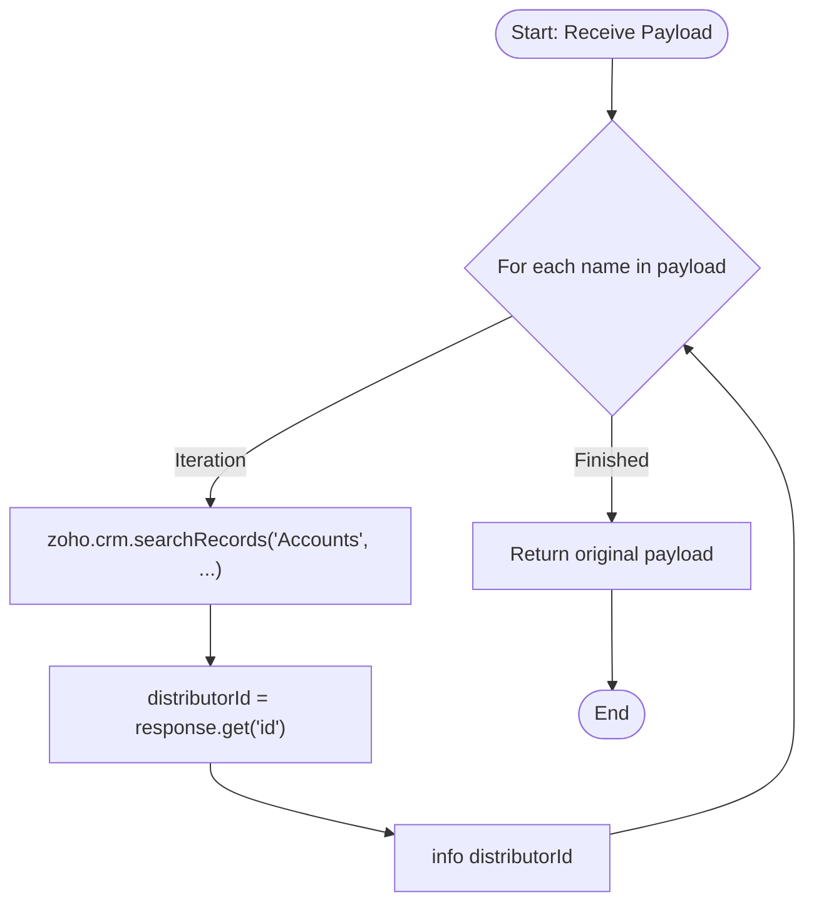

**Postman Documentation:** [Link to API Collection Placeholder]

---

## Overview
The `delugeSendToActiveCampaignLimit` function is a validation utility that iterates through a payload to verify the existence of Account records in Zoho CRM. In its latest iteration, the script specifically extracts and logs the CRM Record ID (`distributorId`) for each account found, facilitating more precise debugging and ensuring that unique identifiers are accessible during the process.

## Technical Contract
- **Input:** `String payload` (Expected to be an iterable collection or a string that can be parsed as one).
- **Output:** `String` (The original payload returned back to the caller).
- **Primary Entities:** 
    - Zoho CRM (Accounts Module)
    - ActiveCampaign (Contextual destination)
    - Zoho Standalone Functions (Environment)

## Dependency Map
This script orchestrates the following internal functions and external services:

| Function / Service | Purpose | Criticality |
| --- | --- | --- |
| Zoho CRM (Accounts) | Searches for account records based on the names provided in the payload. | High |

## Logic Flow
The function iterates through the input, performs a CRM lookup, extracts the unique Record ID, and logs it before returning the original data.

## Core Logic Sections
The script consists of the following logical components:

### 1. Iterable Payload Processing
The function treats the `payload` parameter as a collection. It enters a `for each` loop to process individual items (names) within the payload.

### 2. CRM Account Verification
For every name extracted from the payload, the script executes a `zoho.crm.searchRecords` call against the **Accounts** module. It uses a criteria search to find records where the `Account_Name` exactly matches the provided name.

### 3. ID Extraction and Logging
Instead of logging the entire JSON response, the script now isolates the `id` field from the CRM response and assigns it to the variable `distributorId`. This value is then logged to the console via the `info` statement.

## Developer Notes

> [!CAUTION]
> The `payload` parameter is defined as a `String`. If a primitive string is passed instead of a list/collection, the `for each` loop may only execute once or fail depending on the caller's implementation. Ensure the calling script passes a list variable.

> [!IMPORTANT]
> This script performs a CRM search inside a loop. If the `payload` contains a large number of items, this will consume significant API tasks and may hit Zoho's execution timeout or statement limits.

> [!CAUTION]
> `zoho.crm.searchRecords` returns a **List** of maps. Attempting to call `.get("id")` directly on the `response` (as seen in the current code) may result in a null value or error if the list is not indexed (e.g., `response.get(0).get("id")`). Developers should verify if the response contains data before extraction.

> [!TIP]
> The transition from logging the full response to just the `distributorId` makes the execution logs much cleaner and easier to read when processing large batches of names.

## Change Log
- **2026-03-24T13:44:57.179Z:** Initial creation of documentation via DeluluDocu.
- **2026-03-24T14:16:16.993Z:** Updated script logic to include a `for each` loop and `zoho.crm.searchRecords` integration. The function now validates account names against the CRM database instead of simply logging the raw payload.
- **2026-03-24T14:17:58.763Z:** Updated logic to extract the specific CRM Record ID (`distributorId`) from the search response and log it, rather than logging the entire search result object.