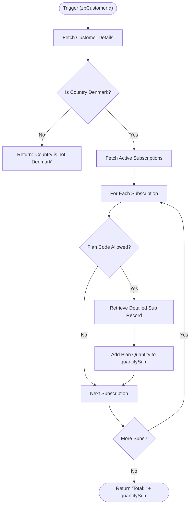

---

## Overview
This script is designed to aggregate the total quantity of specific active subscription plans for a given customer in Zoho Billing. It acts as a pre-calculation step for a tiered discount system, specifically targeting customers located in Denmark. By summing the quantities of allowed plan codes, it provides the basis for determining which discount tier a customer qualifies for.

This documentation was generated by AI.

## Technical Contract
- **Input:** `Int zbCustomerId` - The unique identifier for the customer in Zoho Billing.
- **Output:** `string` - A string representing the total summed quantity (e.g., "Total: 12") or an exit message if validation fails.
- **Primary Entities:** 
    - **Zoho Billing**: Customers, Subscriptions.

## Dependency Map
This script orchestrates the following internal functions and external services:

| Function / Service | Purpose | Criticality |
| --- | --- | --- |
| Zoho Billing API (`invokeapi`) | Fetches customer details and filters active subscriptions. | High |
| Zoho Billing API (`zoho.billing.retrieve`) | Retrieves specific subscription details to access granular quantity data. | High |

## Logic Flow

## Core Logic Sections

### 1. Configuration & Initial Validation
The script defines hardcoded `orgId` and `allowedPlanCodes` ("1200", "1200-SM"). It immediately performs a GET request to the Zoho Billing Customer endpoint to verify the customer's `billing_address`. If the country is not "Denmark", the script terminates early to prevent unnecessary processing for out-of-region accounts.

### 2. Active Subscription Discovery
The script queries the Zoho Billing API for all subscriptions associated with the `zbCustomerId` that have a status of `ACTIVE`. 

### 3. Quantity Aggregation (N+1 Query Pattern)
The script iterates through the list of active subscriptions. If a subscription's `plan_code` matches the `allowedPlanCodes`, it performs a secondary `zoho.billing.retrieve` call for that specific subscription ID. This is done to ensure the most accurate `plan.quantity` is retrieved. The quantities are summed into the `quantitySum` variable.

## Developer Notes

> [!CAUTION]
> **Performance Risk (N+1 Query):** The script performs a `zoho.billing.retrieve` inside a `for each` loop. If a customer has a large number of active subscriptions (e.g., 20+), this will result in 20+ API calls, which may lead to script timeout or API rate limiting.

> [!IMPORTANT]
> **Unused Configuration:** The `tiers` list-of-maps is defined at the top of the script but is currently unused in the logic. The script only returns the sum and does not yet apply the logic to determine the `code` (e.g., "1200-15") based on the tiers.

> [!TIP]
> **Security:** Ensure the `zohobillingconnection` has sufficient scopes (`ZohoBilling.subscriptions.READ`, `ZohoBilling.customers.READ`) for both `invokeapi` and `zoho.billing` tasks.

## Change Log
- **2026-04-01T07:10:58.501Z:** Initial creation of documentation via DeluluDocu. (AI generated)