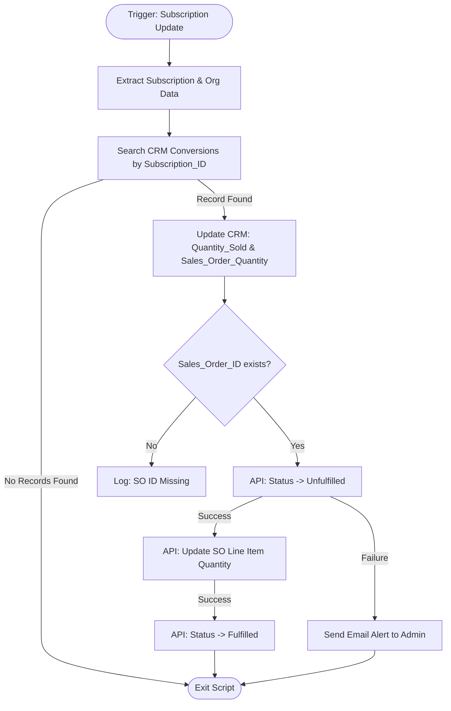

**Postman Documentation:** [Link to API Collection Placeholder]

---

## Overview
The `delugeUpdatePurchaseConversionAndSoQty` function is designed to synchronize quantity updates from Zoho Subscriptions to both Zoho CRM and Zoho Inventory. 

Triggered by an update in a subscription (likely via a Webhook or Custom Function in Zoho Subscriptions), the script locates a matching "Conversion" record in CRM using the `subscription_id`. It then updates the CRM record's quantity and proceeds to modify the associated Sales Order in Zoho Inventory. To allow updates on fulfilled Sales Orders, the script temporarily reverts the status to "unfulfilled," applies the quantity change, and then restores the "fulfilled" status.

## Technical Contract
- **Input:** 
    - `organization`: Map containing `organization_id`.
    - `subscriptions`: Map containing `subscription_id`, `plan` details, and `customer_id`.
- **Output:** Execution logs and status messages. Side effects include updates to CRM Records and Inventory Sales Orders.
- **Primary Entities:** 
    - Zoho CRM (Conversions module)
    - Zoho Inventory (Sales Orders)
    - Zoho Subscriptions (Source)

## Dependency Map
This script orchestrates the following internal functions and external services:

| Function / Service | Purpose | Criticality |
| --- | --- | --- |
| Zoho CRM API | Searching and updating records in the "Conversions" custom module. | High |
| Zoho Inventory API | Modifying Sales Order status and quantities via `invokeurl`. | High |
| `zohoinventory` Connection | OAuth connection required for Inventory API calls. | High |

## Logic Flow

## Core Logic Sections

### 1. Data Initialization & CRM Retrieval
The script extracts the Organization ID and Subscription metadata. It performs a CRM search on the `Conversions` module using the `subscription_id` as the primary key. If no record is found, the script terminates early to prevent errors.

### 2. CRM Record Update
If a matching conversion record exists, the script updates the `Quantity_Sold` and `Sales_Order_Quantity` fields in the CRM `Conversions` module to match the new subscription quantity.

### 3. Inventory Sales Order State Management
Sales Orders in Zoho Inventory cannot be modified while in a "Fulfilled" status. 
- **Transition 1:** The script calls the `/status/unfulfilled` endpoint.
- **Update:** Once unfulfilled, a `PUT` request updates the line item quantity, `item_id`, and `warehouse_id`.
- **Transition 2:** The script calls the `/status/fulfilled` endpoint to restore the original state.

## Developer Notes

> [!WARNING]
> This script is specifically configured for the **Zoho EU** data center (`zohoapis.eu`). If the organization is moved to a different DC (e.g., .com or .in), the `invokeurl` URLs must be updated.

> [!CAUTION]
> The Inventory update logic assumes a 1:1 relationship between the Subscription and a specific line item on the Sales Order. If a Sales Order contains multiple line items not accounted for in this script, they may be overwritten or cause data inconsistency.

> [!IMPORTANT]
> A hardcoded email address `mp@cordulus.com` is used for failure notifications. This should be updated to a group alias or a dynamic environment variable if the maintainer changes.

> [!TIP]
> Ensure the connection `zohoinventory` has the following scopes: `ZohoInventory.salesorders.UPDATE`, `ZohoInventory.salesorders.READ`.

## Change Log
- **2026-03-19T21:12:07.984Z:** Initial creation of documentation via DeluluDocu.