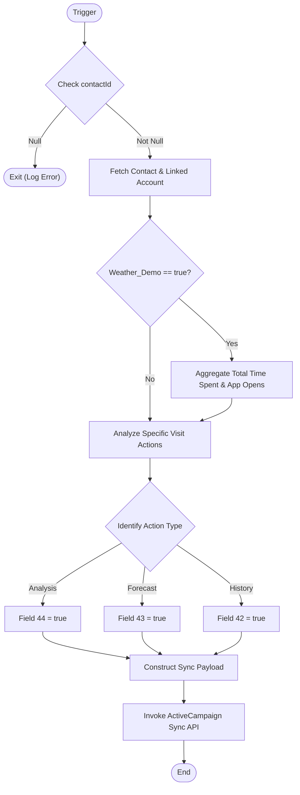

**Postman Documentation:** [Link to API Collection Placeholder]

---

## Overview
The `delugeVisitsToActiveCampaign` function serves as a bridge between Zoho CRM and ActiveCampaign. Its primary role is to synchronize behavioral data captured during user visits—such as time spent, app usage, and specific page interactions (Forecast, Analysis, History)—to ActiveCampaign contact fields. This enables targeted marketing automation based on how users interact with the Cordulus platform (e.g., distinguishing between web users and app users).

## Technical Contract
- **Input:** 
    - `Int visitId`: The ID of the specific visit record being processed.
    - `Int contactId`: The ID of the CRM Contact associated with the visit.
    - `String activeCampaignId`: The unique identifier for the contact in ActiveCampaign.
- **Output:** `void` (Side effect: Updates external ActiveCampaign records via API).
- **Primary Entities:** 
    - `Contacts` (Zoho CRM)
    - `Accounts` (Zoho CRM)
    - `Visits_Zoho_Livedesk` (Zoho CRM Related List)
    - `Actions_Performed` (Zoho CRM Related List)
    - `ActiveCampaign API` (External Service)

## Dependency Map
This script orchestrates the following internal functions and external services:

| Function / Service | Purpose | Criticality |
| --- | --- | --- |
| [[ActiveCampaign API]] | External endpoint for syncing contact field data (`/api/3/contact/sync`). | High |
| [[Zoho CRM Modules]] | Source of Contact, Account, and Visit behavioral data. | High |

## Logic Flow

## Core Logic Sections

### 1. Data Context Retrieval
The script first validates the `contactId` and retrieves the Contact's email and linked Account. It specifically checks for the `Weather_Demo` boolean on the Account record, which acts as a feature gate for processing visit history.

### 2. Contact-Level Visit Aggregation
If `Weather_Demo` is active, the script iterates through **all** related visits for the contact (`Visits_Zoho_Livedesk`). It calculates:
- **Total Time Spent:** Cumulative duration across all visits.
- **App Open Detection:** Identifies visits originating from iOS/Android devices without a specific URL, marking them as mobile app interactions.

### 3. Granular Action Analysis
The script examines the `Actions_Performed` related to the specific `visitId` passed in the arguments. It parses the `Visited_Page` string to flag if the user viewed "Analysis", "Forecast", or "History" pages, mapping these to specific ActiveCampaign custom field IDs.

### 4. ActiveCampaign Synchronization
Data is bundled into a `contact` map containing the email and a `fieldValues` list. The script uses the `invokeurl` task with the `activecampaign` connection to perform a "sync" operation, which either creates or updates the contact in ActiveCampaign.

## Developer Notes

> [!WARNING]
> **Hardcoded Field IDs:** The script uses hardcoded field IDs for ActiveCampaign (e.g., `"40"`, `"41"`, `"42"`, `"43"`, `"44"`). If the custom fields in ActiveCampaign are deleted or recreated, these IDs must be updated manually in the code.

> [!IMPORTANT]
> **Connection Dependency:** This script requires a Zoho North-bound connection named `activecampaign` to be pre-configured with the correct API credentials.

> [!NOTE]
> The `try-catch` block catches execution errors but only logs them to the `info` console. There is currently no secondary alerting (like an email to admins) if the sync fails.

## Change Log
- **2026-03-19T18:56:53.195Z:** Initial creation of documentation via DeluluDocu. 
- **2026-03-19:** Integrated `Actions_Performed` logic to track Forecast/Analysis/History views.