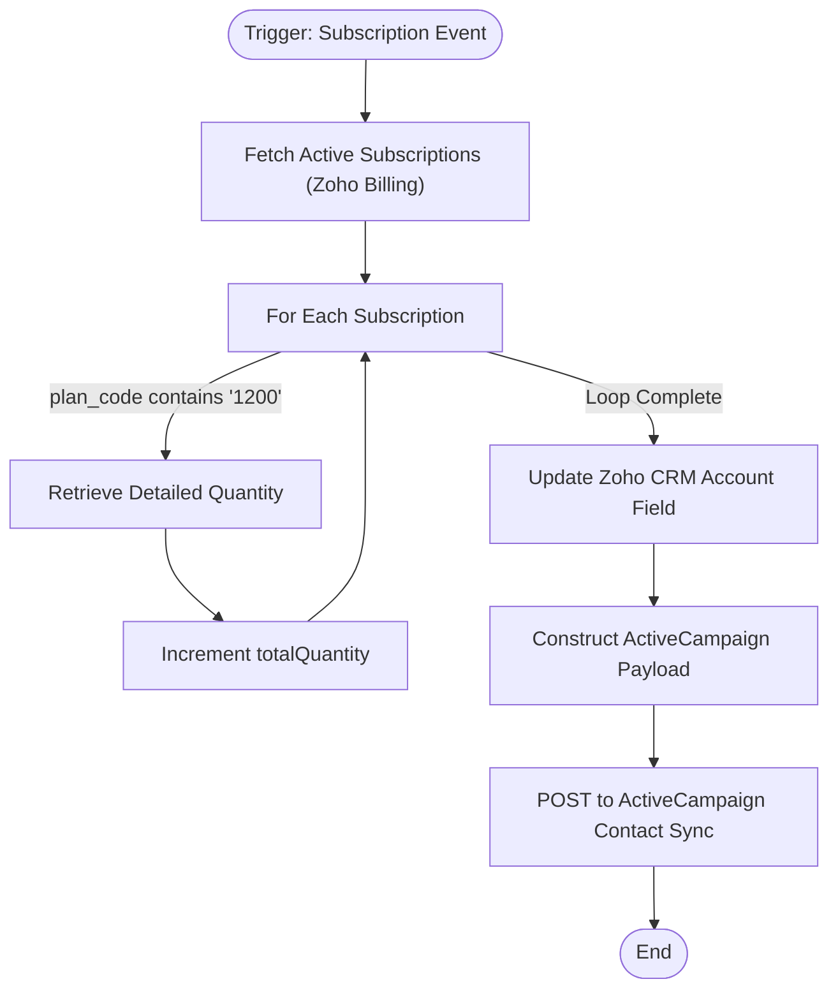

**Postman Documentation:** [Link to API Collection Placeholder]

---

## Overview
The `delugeWeatherStationQuantityUpdate` function is designed to synchronize the total number of "Weather Station" units owned by a customer across the Cordulus ecosystem. It is triggered by a subscription event in Zoho Billing. The script aggregates quantities from all active subscriptions containing specific plan codes, updates the corresponding Account record in Zoho CRM, and synchronizes this data to ActiveCampaign for marketing automation.

## Technical Contract
- **Input:** `subscriptions` (Map) - The standard payload from a Zoho Billing subscription webhook.
- **Output:** None (Side-effect oriented: CRM Update and External API Call).
- **Primary Entities:** 
    - Zoho Billing (Subscriptions)
    - Zoho CRM (Accounts)
    - ActiveCampaign (Contacts)

## Dependency Map
This script orchestrates the following internal functions and external services:

| Function / Service | Purpose | Criticality |
| --- | --- | --- |
| [[Zoho Billing API]] | Retrieve detailed subscription quantities for specific plans. | High |
| [[Zoho CRM API]] | Update the 'Weather_Station_s' field on the Account record. | High |
| [[ActiveCampaign API]] | Sync the aggregated quantity to a custom field in ActiveCampaign. | Medium |

## Logic Flow

## Core Logic Sections

### 1. Subscription Aggregation
The script queries the Zoho Billing API to find all subscriptions for the specific customer that have a status of `ACTIVE`. It iterates through these results, filtering for plans where the `plan_code` contains the string "1200" (the identifier for Weather Station hardware/service).

### 2. CRM Synchronization
Once the `totalQuantity` is calculated, the script identifies the linked CRM Account using `zcrm_account_id`. It updates the custom field `Weather_Station_s` with the string representation of the total count.

### 3. ActiveCampaign Integration
The script formats a JSON payload for the ActiveCampaign "Contact Sync" endpoint. It maps the `totalQuantity` to a specific custom field (ID "13") to ensure marketing segments are kept up to date based on the customer's current hardware count.

## Developer Notes

> [!CAUTION]
> **Performance Warning:** The script performs a `zoho.billing.retrieve` call inside a `for each` loop. If a customer has an exceptionally high number of active subscriptions, this could hit Zoho's integration task limits or timeout.

> [!IMPORTANT]
> **Plan Code Hardcoding:** The filtering logic relies on the string `"1200"`. If the naming convention for Weather Station plans changes in Zoho Billing, this script will fail to aggregate quantities correctly.

> [!TIP]
> **Connection Requirements:** This script requires two OAuth connections: `zohobilling` (with Billing scopes) and `activecampaignall` (an invokeurl connection with the appropriate API key headers or credentials).

## Change Log
- **2026-03-19T21:11:49.579Z:** Initial creation of documentation via DeluluDocu.