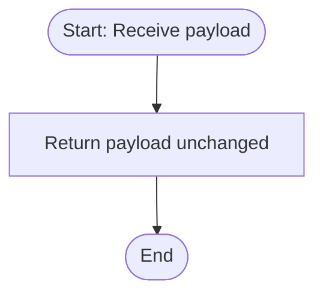

**Postman Documentation:** [Link to API Collection Placeholder]

---

## Overview
The `delugeSendToActiveCampaignLimit` function acts as a standalone utility within the Cordulus ecosystem, specifically designed to handle data payloads destined for ActiveCampaign. In its current state, the function serves as a passthrough or "identity" function, receiving a string payload and returning it without modification. The naming suggests it is intended to manage or monitor throughput limits for ActiveCampaign integration.

## Technical Contract
- **Input:** `String payload` (The data intended for ActiveCampaign)
- **Output:** `String` (The original payload returned)
- **Primary Entities:** External: ActiveCampaign

## Dependency Map
This script orchestrates the following internal functions and external services:

| Function / Service | Purpose | Criticality |
| --- | --- | --- |
| N/A | This script currently has no internal dependencies. | N/A |

## Logic Flow
The script follows a direct execution path where the input is immediately returned to the caller.

## Core Logic Sections
The script contains a single logical operation.

### 1. Data Passthrough
The function receives a string argument named `payload` and utilizes the `return` statement to send that exact string back to the calling process.

## Developer Notes

> [!NOTE]
> This script currently performs no logic, validation, or transformation. It appears to be a placeholder or a stub for future rate-limiting logic or a "middleware" step in an integration pipeline.

> [!TIP]
> If implementing ActiveCampaign API limits in the future, this is the centralized location where logic should be added to check against execution quotas or timestamps before proceeding.

## Change Log
- **2026-03-24T13:30:10.150Z:** Initial creation of documentation via DeluluDocu. Documented the passthrough nature of the script.