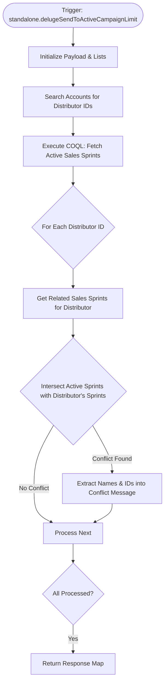

**Postman Documentation:** [Link to API Collection Placeholder]

---

## Overview
The `standalone.delugeSendToActiveCampaignLimit` script is a validation utility designed to prevent data collisions when syncing Sales Sprints to ActiveCampaign. Its primary purpose is to identify if a set of distributors (Farm Distributors) are already associated with any "Active" Sales Sprints that are flagged for ActiveCampaign synchronization. 

The script performs a lookup on provided distributor names, identifies their IDs, retrieves all currently active Sales Sprints via COQL, and then checks for intersections between the distributor's history and active campaigns.

## Technical Contract
- **Input:** `String payload` (Note: Current implementation overwrites this input with a hardcoded list).
- **Output:** `Map` containing `status` ("error") and a detailed `message` if conflicts are found.
- **Primary Entities:** 
    - `Accounts` (Distributors)
    - `Sales_Sprints` (Campaign management)
    - `Related_Sales_Sprints_2` (Linking module/subform)

## Dependency Map
This script orchestrates the following internal functions and external services:

| Function / Service | Purpose | Criticality |
| --- | --- | --- |
| Zoho CRM COQL API | Executes a high-performance query to find active Sales Sprints. | High |
| zohocrmconnection | The OAuth connection used for the COQL API call. | High |
| `zoho.crm.searchRecords` | Used to find Account IDs based on distributor names. | Medium |
| `zoho.crm.getRelatedRecords` | Fetches the junction data between Accounts and Sales Sprints. | High |

## Logic Flow

## Core Logic Sections

### 1. Distributor Identification
The script initializes a list of distributor names. It queries the `Accounts` module looking for records where the name matches and the `Distributor_Type` is strictly "Farm Distributor". The resulting IDs are stored in a `distributors` list.

### 2. Active Campaign Discovery (COQL)
To ensure accuracy and performance, the script uses the Zoho CRM COQL (V2) API. It targets the `Sales_Sprints` module to find all records where `Sales_Sprint_Active` is 'Yes' and `Send_to_Active_Campaign` is true.

### 3. Conflict Validation (Intersection Logic)
The script iterates through the identified distributors. For each, it fetches their related sprint history. It uses the `.intersect()` Deluge method to compare the distributor's history against the global list of active sprints. If an intersection exists, it signifies that the distributor is already involved in an ongoing campaign, which would cause a limit/collision issue in ActiveCampaign.

### 4. Error Reporting
If conflicts are found, the script maps the intersecting IDs back to the record names to generate a human-readable error message, which is then returned to the calling process.

## Developer Notes

> [!WARNING]
> The input parameter `payload` is currently hardcoded within the first line of the script (`payload = {"Swedish Agro","Hankkija Oy"};`). This effectively ignores any parameters passed during the function call. This should be removed for dynamic production use.

> [!CAUTION]
> The script uses `zoho.crm.getRelatedRecords`. If a distributor is associated with more than 200 sprints (the default limit), the intersection logic might miss older or newer records depending on the sort order, potentially bypassing the validation.

> [!TIP]
> The use of COQL here is highly efficient for filtering the `Sales_Sprints` module, as it bypasses the limitations of standard `searchRecords` when dealing with multiple criteria on large datasets.

## Change Log
- **2026-03-24T14:40:43.820Z:** Initial creation of documentation via DeluluDocu.