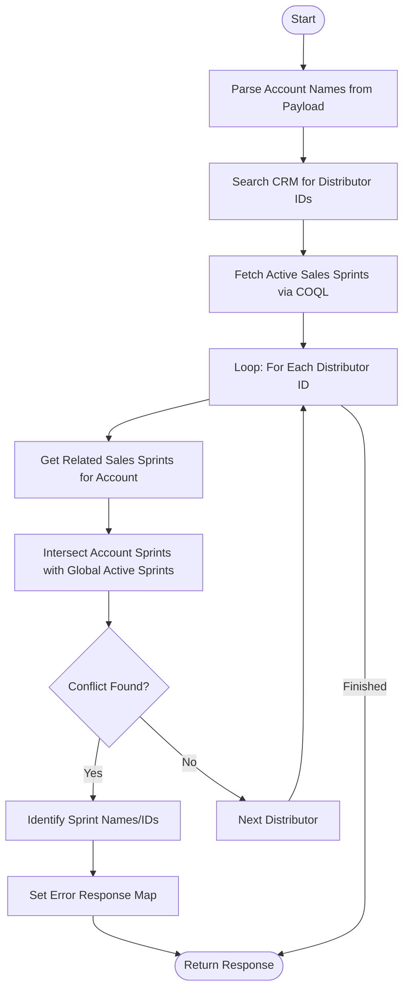

**Postman Documentation:** [Link to API Collection Placeholder]

---

## Overview
The `standalone.delugeSendToActiveCampaignLimit` function is a validation utility within the Cordulus Zoho CRM environment. Its primary purpose is to prevent "Farm Distributors" (Accounts) from being added to new Active Campaign syncs if they are already associated with an existing, active Sales Sprint. It acts as a guardrail to prevent marketing overlaps or data duplication in external marketing tools.

## Technical Contract
- **Input:** `String payload` (A string-formatted list/array of Account names to check).
- **Output:** `Map` (Returns a status of "error" and a detailed conflict message if overlaps are found; otherwise returns an uninitialized or empty map).
- **Primary Entities:** 
    - `Accounts` (Distributor records)
    - `Sales_Sprints` (Campaign management module)
    - `Related_Sales_Sprints_2` (Related list/junction entity)

## Dependency Map
This script orchestrates the following internal functions and external services:

| Function / Service | Purpose | Criticality |
| --- | --- | --- |
| `zoho.crm.searchRecords` | Locates Account IDs based on names and filters for Active Sales Sprints. | High |
| `zoho.crm.getRelatedRecords` | Retrieves the junction records connecting Accounts to Sales Sprints. | High |
| `invokeurl` (COQL) | Executes a high-performance query to find all active Sales Sprints marked for Active Campaign sync. | High |
| `zohocrmconnection` | The OAuth connection used for COQL queries. | High |

## Logic Flow

## Core Logic Sections

### 1. Account Identification
The script first iterates through the names provided in the payload string. It performs a CRM search on the `Accounts` module, enforcing two criteria: the `Account_Name` must match and the `Distributor_Type` must be "Farm Distributor". It collects these IDs into a list for processing.

### 2. Active Sprint Retrieval (COQL)
To ensure high accuracy and bypass potential search limits, the script uses Zoho CRM's COQL (Query Language) to find all records in the `Sales_Sprints` module where `Sales_Sprint_Active` is true ('Yes') and `Send_to_Active_Campaign` is true.

### 3. Conflict Intersection Logic
For every identified distributor, the script fetches its related Sales Sprints. It uses the `.intersect()` Deluge method to compare the Sprints the account is *already* in against the list of *currently active* Sprints. If the resulting intersection list is not empty, a conflict is flagged.

### 4. Error Message Assembly
If conflicts are found, the script loops through the intersection list to find the specific human-readable names of the conflicting Sprints to provide a clear error message to the user/calling process.

## Developer Notes

> [!WARNING]
> **Variable Initialization Risk:** The `response` Map is only initialized within the `if(!uniqueConflicts.isEmpty())` block. If the script runs and finds no conflicts, it returns `response` which would be null/uninitialized, potentially causing errors in the calling script. It is recommended to initialize `response = Map();` at the top.

> [!IMPORTANT]
> **Hardcoded Connection:** The script relies on a connection named `zohocrmconnection`. If this connection is deleted or renamed, the COQL portion of the script will fail.

> [!TIP]
> This script uses `.toString()` during ID comparison. This is a best practice in Deluge to avoid "BigInt vs String" comparison failures common when handling CRM IDs.

## Change Log
- **2025-01-24T12:30:00.000Z:** Initial creation of documentation via DeluluDocu. Added analysis of COQL usage and intersection logic.