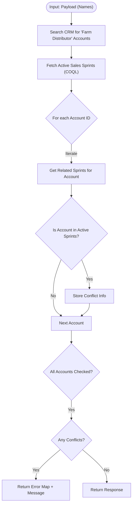

**Postman Documentation:** [Link to API Collection Placeholder]

---

## Overview
This script acts as a validation gate for the ActiveCampaign integration. It ensures that a list of distributors (Accounts) provided in the payload is not already associated with any currently active "Sales Sprints" that are flagged for ActiveCampaign syncing. Its primary role is to prevent overlapping marketing communications or data conflicts within the Cordulus ecosystem.

## Technical Contract
- **Input:** `String payload` (Expected to be a list or a string-represented list of Account Names).
- **Output:** `Map` (Returns a status of "error" and a detailed conflict message if overlaps are found; otherwise returns an uninitialized/empty map).
- **Primary Entities:** 
    - `Accounts` (Module)
    - `Sales_Sprints` (Module)
    - `Related_Sales_Sprints_2` (Subform/Related List)

## Dependency Map
This script orchestrates the following internal functions and external services:

| Function / Service | Purpose | Criticality |
| --- | --- | --- |
| `zoho.crm.searchRecords` | Locates Account IDs based on names and filters for "Farm Distributors". | High |
| `zoho.crm.getRelatedRecords` | Fetches the junction records between Accounts and Sales Sprints. | High |
| `Zoho CRM COQL API` | Retrieves active Sales Sprints using a SQL-like query for performance. | High |
| `zohocrmconnection` | OAuth Connection for `invokeurl` calls to the CRM API. | High |

## Logic Flow

## Core Logic Sections

### 1. Account Identification
The script iterates through the `payload` names. It performs a targeted search in the Accounts module where the name matches and the `Distributor_Type` is specifically "Farm Distributor". This ensures only relevant distributor entities are validated.

### 2. Global Active Sprint Retrieval
To optimize performance, the script uses a COQL (Zoho CRM Object Query Language) query. It targets the `Sales_Sprints` module to find all records where:
- `Sales_Sprint_Active` is "Yes"
- `Send_to_Active_Campaign` is `true`

### 3. Conflict Intersection Logic
For every distributor identified in step 1, the script retrieves its existing associations via `getRelatedRecords`. It then uses the Deluge `.intersect()` method to compare the distributor's associated sprints against the global list of active sprints. If an intersection is found, it indicates the distributor is already part of a running campaign.

## Developer Notes

> [!WARNING]
> **API Limits:** The script performs a `getRelatedRecords` call inside a `for each` loop of the payload. If the payload contains a large number of distributors, this could potentially hit CRM API request limits.

> [!CAUTION]
> **Data Type Mismatch:** The function signature is defined as returning a `string`, but the internal logic constructs and returns a `Map`. Depending on how this function is called (e.g., as a REST API vs. internal Deluge call), this might cause a casting error or unexpected behavior.

> [!TIP]
> **Redundant Search:** There is a redundant `zoho.crm.searchRecords` call for Sales Sprints at the beginning of the script that is immediately overwritten by the COQL `invokeurl` result. This can be removed to save one API credit.

## Change Log
- **2026-03-24T15:01:34.922Z:** Initial creation of documentation for the ActiveCampaign validation limit script.