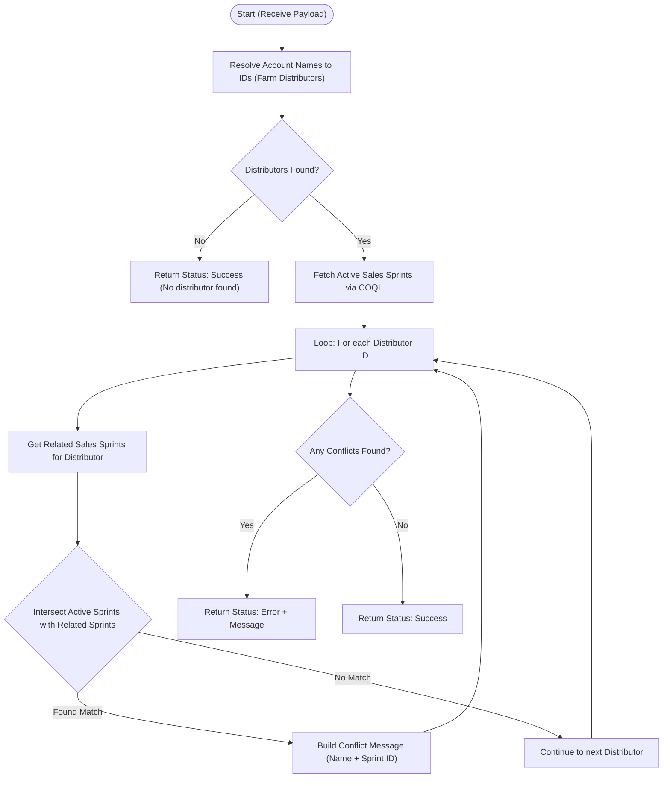

**Postman Documentation:** [Link to API Collection Placeholder]

---

## Overview
The `standalone.delugeSendToActiveCampaignLimit` script serves as a validation layer within the Cordulus Zoho CRM environment. Its primary purpose is to ensure that specific **Farm Distributors** (Accounts) are not simultaneously enrolled in multiple active **Sales Sprints**. 

The script is typically triggered before a data sync to Active Campaign, acting as a "guardrail" to prevent marketing overlap or data conflicts. It identifies distributors by name, retrieves currently active sprints via COQL, and checks for intersections between a distributor's existing associations and the global list of active campaigns.

## Technical Contract
- **Input:** `String payload` (A list of Account Names, e.g., `["Swedish Agro", "Hankkija Oy"]`)
- **Output:** `Map` (Contains `status`: "success"|"error" and a descriptive `message`)
- **Primary Entities:** 
    - `Accounts` (specifically `Distributor_Type: Farm Distributor`)
    - `Sales_Sprints`
    - `Related_Sales_Sprints_2` (Related List/Linking module)

## Dependency Map
This script orchestrates the following internal functions and external services:

| Function / Service | Purpose | Criticality |
| --- | --- | --- |
| Zoho CRM COQL | Efficiently queries active Sales Sprints using SQL-like syntax. | High |
| `zohocrmconnection` | OAuth connection used for COQL `invokeurl` call. | High |

## Logic Flow

## Core Logic Sections

### 1. Distributor Identification
The script iterates through the input payload to find Account IDs. It enforces a strict filter where the `Account_Name` must match the payload and the `Distributor_Type` must be exactly `"Farm Distributor"`.

### 2. Active Sprint Retrieval (COQL)
Instead of a standard `searchRecords`, the script uses a **COQL (Zoho CRM Object Query Language)** query. This is used to precisely target `Sales_Sprints` where:
- `Sales_Sprint_Active` is 'Yes'
- `Send_to_Active_Campaign` is true

### 3. Intersection & Conflict Logic
For every distributor identified in the payload:
1. It fetches all Sales Sprints linked to that distributor.
2. It uses the `.intersect()` Deluge method to compare the distributor's sprints against the list of globally active sprints.
3. If an intersection exists, it signifies the distributor is already involved in an active campaign, triggering a conflict error.

## Developer Notes

> [!IMPORTANT]
> This script relies on a Zoho CRM Connection named `zohocrmconnection`. Ensure this connection has the `ZohoCRM.coql.READ` and `ZohoCRM.modules.ALL` scopes enabled.

> [!WARNING]
> **Redundant Query:** The script performs a `zoho.crm.searchRecords` for Sales Sprints and stores it in `activeSalesSprints`, but immediately overwrites that variable with the result of the COQL query. The initial `searchRecords` call is unnecessary and consumes API credits.

> [!TIP]
> The conflict message includes both the Distributor Name and the Sales Sprint ID, which is helpful for debugging which specific record is blocking the process.

## Change Log
- **2025-02-11T11:45:00Z:** Initial creation of documentation. Script implements COQL validation to prevent distributor overlap in active sales campaigns.