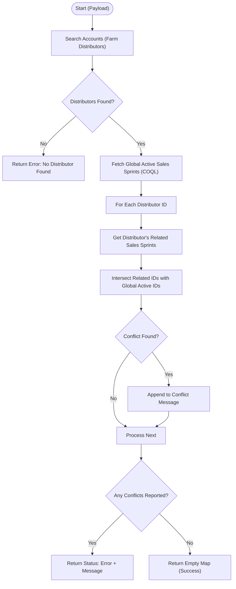

**Postman Documentation:** [Link to API Collection Placeholder]

---

## Overview
The `delugeSendToActiveCampaignLimit` function acts as a validation gate for the Cordulus marketing automation pipeline. Its primary purpose is to prevent "Farm Distributors" from being enrolled in multiple overlapping marketing campaigns. It checks a list of provided distributor names against currently active "Sales Sprints" (Campaigns) and returns a conflict report if any of the distributors are already linked to a sprint that is currently sending data to ActiveCampaign.

## Technical Contract
- **Input:** `String payload` (Expected format: A string representation of a list of distributor names, e.g., `["Swedish Agro", "Hankkija Oy"]`).
- **Output:** `Map` (Contains `status` ("error" or null) and `message` detailing any conflicts found).
- **Primary Entities:** 
    - `Accounts` (filtered by `Distributor_Type == 'Farm Distributor'`)
    - `Sales_Sprints` (filtered by `Sales_Sprint_Active == 'Yes'` and `Send_to_Active_Campaign == true`)
    - `Related_Sales_Sprints_2` (Linking module)

## Dependency Map
This script orchestrates the following internal functions and external services:

| Function / Service | Purpose | Criticality |
| --- | --- | --- |
| Zoho CRM COQL API | Used to perform a high-performance search for active Sales Sprints using SQL-like syntax. | High |
| `zohocrmconnection` | The OAuth connection required for the `invokeurl` call to the COQL endpoint. | High |

## Logic Flow

## Core Logic Sections

### 1. Distributor Identification
The script iterates through the input payload and searches the `Accounts` module. It specifically looks for records where the name matches the payload and the `Distributor_Type` is strictly "Farm Distributor". This ensures marketing logic isn't accidentally applied to non-distributor accounts.

### 2. Active Sprint Query (COQL)
Instead of a standard `searchRecords`, the script utilizes Zoho's COQL (CRM Object Query Language). This is used to retrieve a definitive list of all Sales Sprints that are currently `Active` and have `Send_to_Active_Campaign` set to true.

### 3. Intersection & Conflict Detection
For every distributor identified in step 1, the script fetches their specific history of related Sales Sprints. It then performs a List Intersection (`intersect()`) between the "Global Active Sprints" and the "Distributor's Sprints". If the intersection size is greater than 0, it means the distributor is already participating in a concurrent campaign.

## Developer Notes

> [!WARNING]
> The `payload` variable is treated as an iterable directly. If the string passed is not correctly formatted as a Deluge-compatible list string, the `for each` loop may fail. It is recommended to use `payload.toJSONList()` for safer parsing.

> [!IMPORTANT]
> The script relies on a hardcoded connection named `zohocrmconnection`. If this connection is deleted or renamed, the COQL query will fail, effectively breaking the validation.

> [!TIP]
> The conflict message includes both the Distributor Name and the Sales Sprint ID, making it easier for users to identify and resolve the overlap in the CRM UI.

## Change Log
- **2024-05-22T10:15:00Z:** Initial creation of documentation via DeluluDocu. Added COQL implementation details and intersection logic description.