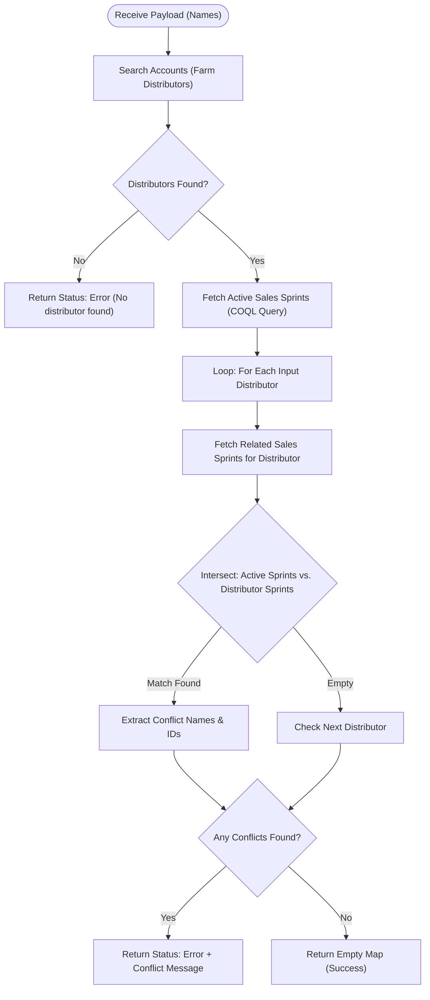

**Postman Documentation:** [Link to API Collection Placeholder]

---

## Overview
The `standalone.delugeSendToActiveCampaignLimit` function is a validation utility designed to prevent data conflicts when syncing distributors to Active Campaign via Sales Sprints. 

The script performs a cross-reference check to ensure that a list of "Farm Distributors" (passed via payload) are not already associated with any currently active Sales Sprints that have the "Send to Active Campaign" flag enabled. If a conflict is found, the script returns a detailed error message identifying the specific distributor and the conflicting Sales Sprint ID.

## Technical Contract
- **Input:** `String payload` (A collection of distributor names, e.g., `{"Swedish Agro", "Hankkija Oy"}`)
- **Output:** `Map` (Contains `status` ["error" or empty] and `message` [conflict details])
- **Primary Entities:** 
    - `Accounts` (specifically filtered by `Distributor_Type: Farm Distributor`)
    - `Sales_Sprints`
    - `Related_Sales_Sprints_2` (Linking module/Related list)

## Dependency Map
This script orchestrates the following internal functions and external services:

| Function / Service | Purpose | Criticality |
| --- | --- | --- |
| Zoho CRM (Accounts) | To identify distributor IDs based on provided names. | High |
| Zoho CRM (COQL API) | To efficiently query all active Sales Sprints via `invokeurl`. | High |
| Zoho CRM (Related Lists) | To fetch the intersection of Distributors and Sales Sprints. | High |

## Logic Flow

## Core Logic Sections

### 1. Distributor Identification
The script iterates through the input `payload` and searches the `Accounts` module. It enforces a strict filter where the `Account_Name` must match the input and the `Distributor_Type` must be "Farm Distributor". It collects the internal Zoho IDs for these records.

### 2. Active Sales Sprint Retrieval (COQL)
Instead of a standard `searchRecords`, the script utilizes a **COQL (Zoho CRM Object Query Language)** query via `invokeurl`. This is used to retrieve all Sales Sprints where `Sales_Sprint_Active` is true and `Send_to_Active_Campaign` is true. This method is more performant and reliable for complex filtering.

### 3. Intersection & Conflict Validation
For every distributor identified in step 1, the script fetches its related Sales Sprints. It then uses the `.intersect()` list method to find IDs that exist in both the "Globally Active" list and the "Distributor's Specific" list. 

> [!TIP]
> Using `intersect()` is a high-performance way to find overlapping IDs between two lists without nested looping logic for every comparison.

## Developer Notes

> [!WARNING]
> **DC Specific URL:** The COQL query is hardcoded to `https://www.zohoapis.eu/crm/v2/coql`. If the client moves to a different Data Center (e.g., .com, .in, .com.au), this URL must be updated or replaced with a variable to prevent failure.

> [!CAUTION]
> **Payload Parsing:** The script expects `payload` as a String but iterates over it immediately (`for each name in payload`). This assumes the Deluge environment is auto-casting a JSON-array-string into a list. If calling this from a source that passes a raw string, use `.toList(",")` or `JSON.decode()`.

> [!NOTE]
> The script uses `zohocrmconnection` for the COQL call. This connection must have the `ZohoCRM.coql.READ` scope enabled.

## Change Log
- **2026-03-24T15:10:10.338Z:** Initial creation of documentation via DeluluDocu.