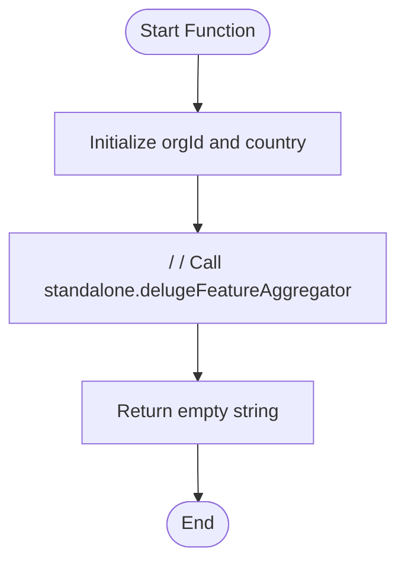

**Postman Documentation:** [Link to API Collection Placeholder]

---

## Overview
The `standalone.ResyncDaggers` function serves as a utility or manual trigger script designed to initiate a data resynchronization process for specific features (referred to as "Daggers") within the Cordulus ecosystem. Currently, the script is configured for a specific organization in Denmark and acts as a wrapper to call the Feature Aggregator logic.

## Technical Contract
- **Input:** None
- **Output:** `string` (Returns an empty string upon completion)
- **Primary Entities:** 
    - Organization (ID: 20087400261)
    - Feature Aggregator Service

## Dependency Map
This script orchestrates the following internal functions and external services:

| Function / Service | Purpose | Criticality |
| --- | --- | --- |
| [[standalone.delugeFeatureAggregator]] | Aggregates feature-specific data for a given organization and country. | High (Intended Core Logic) |

## Logic Flow

## Core Logic Sections

### 1. Context Initialization
The script defines hardcoded values for the synchronization target:
- `orgId`: 20087400261
- `country`: "Denmark"

### 2. Execution Placeholder
The primary logic involving the `standalone.delugeFeatureAggregator` is currently commented out. When active, this function is responsible for processing feature data based on the provided organization and country parameters.

## Developer Notes

> [!NOTE]
> This script appears to be a template or a manual "one-off" trigger used by developers to force a resync. 

> [!WARNING]
> The call to `standalone.delugeFeatureAggregator` is currently commented out. To perform an actual resync, the slashes must be removed and the `customerId` variable must be properly defined or passed as an argument, as it is currently missing from the initialization block.

> [!CAUTION]
> The `orgId` and `country` are hardcoded. Ensure these are updated if this script is reused for different clients or regions.

## Change Log
- **2026-03-31T08:45:56.482Z:** Initial creation of documentation via DeluluDocu.