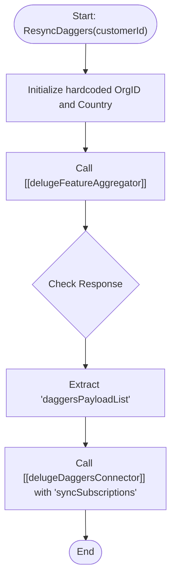

**Postman Documentation:** [Link to API Collection Placeholder]

---

## Overview
The `standalone.ResyncDaggers` function is a maintenance utility designed to synchronize a specific customer's subscription and feature data with the "Daggers" system. It acts as an orchestrator that first gathers processed data via a feature aggregator and then pushes that payload to the Daggers connector to ensure external systems are aligned with the Zoho source of truth.

## Technical Contract
- **Input:** 
    - `int customerId`: The unique identifier for the customer in the system.
- **Output:** `string` (Returns an empty string upon completion).
- **Primary Entities:** 
    - Zoho Customer Records
    - Subscription Data
    - Daggers External Service

## Dependency Map
This script orchestrates the following internal functions and external services:

| Function / Service | Purpose | Criticality |
| --- | --- | --- |
| [[delugeFeatureAggregator]] | Gathers and formats subscription/feature data for the specific customer. | High |
| [[delugeDaggersConnector]] | Transmits the processed payload to the Daggers synchronization endpoint. | High |

## Logic Flow

## Core Logic Sections

### 1. Context Initialization
The script sets a static context for the operation, specifically targeting the Denmark organization (`20087400261`).

### 2. Data Aggregation
The script invokes [[delugeFeatureAggregator]]. This dependency is responsible for the heavy lifting of looking up customer entitlements, active subscriptions, and formatting them into a structure compatible with the Daggers system.

### 3. External Synchronization
The extracted list (`daggersPayloadList`) is passed to [[delugeDaggersConnector]]. This step performs the actual API handshake to update the external Daggers database with the refreshed subscription state.

## Developer Notes

> [!CAUTION]
> **Undefined Variable:** The variable `workspaceId` is used in the call to `standalone.delugeDaggersConnector` but is never defined or initialized within this script. This will cause a script execution error unless `workspaceId` is handled as a global or the script environment provides it implicitly.

> [!WARNING]
> **Hardcoded Values:** The `orgId` and `country` are hardcoded to "Denmark" and "20087400261". This function is currently not multi-region or multi-org capable without manual code changes.

> [!NOTE]
> The function returns an empty string regardless of whether the `delugeDaggersConnector` call succeeded or failed. Error handling should be implemented to capture the `daggersSyncResponse`.

## Change Log
- **2026-03-31T08:48:20.581Z:** Initial creation of documentation via DeluluDocu.