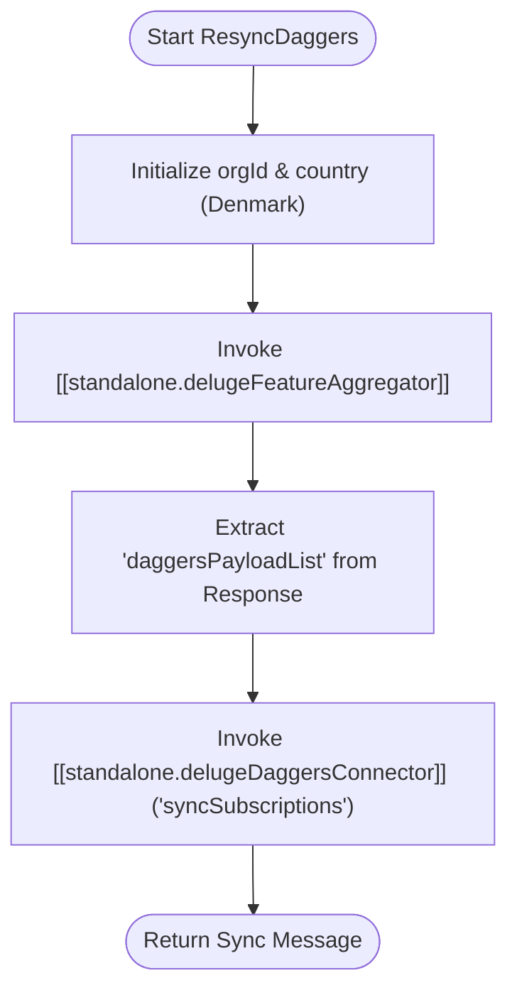

**Postman Documentation:** [Link to API Collection Placeholder]

---

## Overview
The `standalone.ResyncDaggers` function is a utility script designed to force a synchronization of subscription data between Zoho and the internal "Daggers" system for a specific customer. It acts as an orchestrator that first gathers processed feature data and then pushes it to the Daggers handler.

## Technical Contract
- **Input:** 
    - `int customerId`: The unique identifier for the customer in Zoho.
    - `int workspaceId`: The target Daggers workspace ID.
- **Output:** `string` (The status message returned by the Daggers Connector).
- **Primary Entities:** 
    - Subscriptions
    - Daggers System (External)

## Dependency Map
This script orchestrates the following internal functions and external services:

| Function / Service | Purpose | Criticality |
| --- | --- | --- |
| [[standalone.delugeFeatureAggregator]] | Aggregates and formats subscription features into a Daggers-compatible payload. | High |
| [[standalone.delugeDaggersConnector]] | Transmits the payload to the Daggers API to perform the sync. | High |

## Logic Flow

## Core Logic Sections

### 1. Data Aggregation
The script initializes fixed parameters for `orgId` and `country` (defaulting to "Denmark"). It calls the `delugeFeatureAggregator`, which is responsible for looking up all active features and subscriptions tied to the `customerId`.

### 2. Daggers Synchronization
The script extracts the specific list of processed subscription data (`daggersPayloadList`). It then passes this list, along with the `workspaceId`, to the `delugeDaggersConnector` using the `syncSubscriptions` action. This ensures the external Daggers platform matches the current state of Zoho.

## Developer Notes

> [!WARNING]
> The `orgId` (20087400261) and `country` ("Denmark") are currently hardcoded. This script may not function correctly for customers in other regions (e.g., Sweden, Norway) or different organizations without modification.

> [!CAUTION]
> There is no explicit error handling for the `delugeFeatureAggregator` response. If the aggregator returns an error or an empty list, the script will still attempt to pass that data to the `delugeDaggersConnector`.

## Change Log
- **2026-03-31T08:49:17.271Z:** Initial creation of documentation via DeluluDocu.