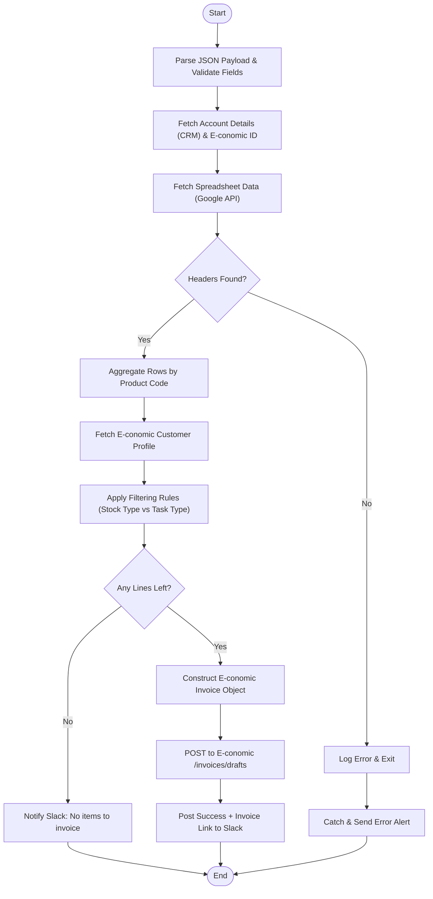

**Postman Documentation:** [Link to API Collection Placeholder]

---

## Overview
This script automates the generation of E-conomic draft invoices based on renewal and sales data hosted in Google Sheets. It acts as an orchestrator that pulls data from a distributor's specific spreadsheet, aggregates product quantities and prices, applies business logic based on the distributor's "Stock Type" (Sales vs. Consignment), and creates the resulting draft invoice in the E-conomic accounting system.

## Technical Contract
- **Input:** `crmAPIRequest` (String) - A JSON payload containing `distributor_id`, `task_type` (Renewals/New Sales), `month`, `year`, and an optional `exchange_rate`.
- **Output:** `string` - Returns `"success"`, `"success: No items to invoice"`, or an `"error: [message]"` string.
- **Primary Entities:** 
    - **Zoho CRM:** Accounts (Distributors)
    - **Google Sheets:** Source of truth for line-item data.
    - **E-conomic:** Target accounting system for draft invoices.
    - **Slack:** Notification channel for success/failure.

## Dependency Map
This script orchestrates the following internal functions and external services:

| Function / Service | Purpose | Criticality |
| --- | --- | --- |
| [[delugePostSuccessMessageToSlack]] | Sends success notifications and draft links to Slack. | Medium |
| [[delugeSendErrorAlert]] | Alerts developers of failures via Slack. | High |
| Google Sheets API | Retrieves row-level billing data from distributor spreadsheets. | High |
| E-conomic REST API | Fetches customer profiles and creates draft invoices. | High |

## Logic Flow

## Core Logic Sections

### 1. Data Retrieval & Aggregation
The script constructs a Google Sheet tab name dynamically (e.g., "April 2026 (Renewals)"). It iterates through the sheet to find the header row. Data is then aggregated into a `summaryMap` using the **E-conomic Product Code** as the unique key. This ensures that multiple rows for the same product are condensed into a single invoice line with summed quantities and prices.

### 2. Business Logic Filtering
The script applies specific accounting rules based on the distributor's `Stock_Type` and the `task_type`:
- **New Sales (Stock Type: Sales):** Only credits negative items (returns).
- **New Sales (Stock Type: Consignment):** Only invoices positive items.
- **Renewals (Stock Type: Sales):** Invoices positive items and credits discount items.
- **Renewals (Stock Type: Consignment):** Invoices positive items.

### 3. E-conomic Integration
The script fetches the E-conomic customer record to inherit settings like `currency`, `paymentTerms`, `layout`, and `vatZone`. It then calculates the `unitNetPrice` by dividing the total price by quantity and applies the provided `exchange_rate` before sending the POST request to create the draft.

## Developer Notes

> [!IMPORTANT]
> The script relies on a strict naming convention for Google Sheet tabs: `Month Year (Task Type)`. If the spreadsheet structure or tab names change, the script will fail to find data.

> [!CAUTION]
> The Slack channel ID (`C09PTU8KKT3`) is hardcoded at the top of the script. This should be moved to a configuration module or environment variable if the channel needs to change frequently.

> [!TIP]
> The script handles exchange rates by dividing the calculated unit price. If no exchange rate is provided in the payload, it defaults to `1`.

## Change Log
- **2025-02-11:** Initial creation of documentation for V2 of the Renewal/Sales processing script. Implemented dynamic header detection and product aggregation logic.