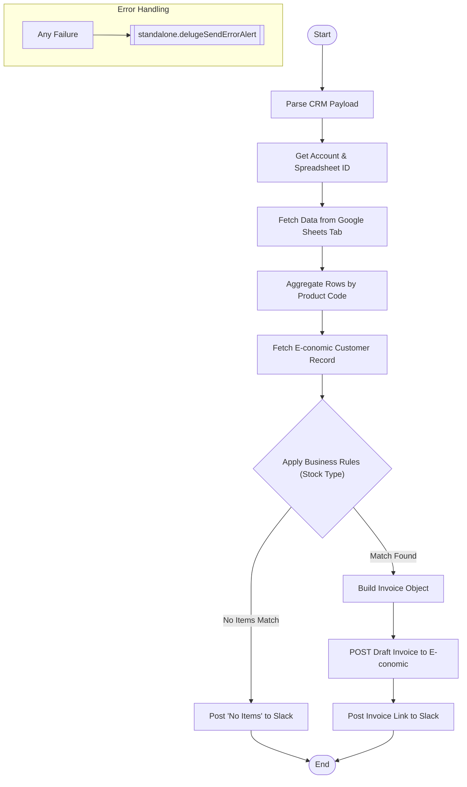

**Postman Documentation:** [Link to API Collection Placeholder]

---

## Overview
This script automates the processing of renewal data and new sales data from Google Spreadsheets into the **E-conomic** accounting system. It is typically triggered by a webhook or a button in Zoho CRM. The script identifies the correct distributor account, fetches relevant sales/renewal data from a dynamically named tab in a Google Sheet, aggregates the items by product code, applies complex business rules based on the distributor's stock type (Sales vs. Consignment), and finally generates a draft invoice in E-conomic.

## Technical Contract
- **Input:** `crmAPIRequest` (String/Map) - Contains distributor details, date parameters, and a download link.
- **Output:** `String` - Returns "success", "success: No items to invoice", or an error message.
- **Primary Entities:** 
    - **Zoho CRM:** Accounts module (Distributor data).
    - **Google Sheets:** Source of line-item data.
    - **E-conomic:** Destination for the draft invoice.
    - **Slack:** For status notifications and error alerts.

## Dependency Map
This script orchestrates the following internal functions and external services:

| Function / Service | Purpose | Criticality |
| --- | --- | --- |
| [[standalone.delugePostSuccessMessageToSlack]] | Posts successful draft creation details and links to Slack. | Medium |
| [[standalone.delugeSendErrorAlert]] | Sends detailed error logs to the developer Slack channel. | High |
| **Google Sheets API** | Fetches row data from the distributor's renewal spreadsheet. | High |
| **E-conomic API** | Fetches customer metadata and creates the draft invoice. | High |

## Logic Flow

## Core Logic Sections

### 1. Spreadsheet Data Extraction
The script dynamically constructs a tab name using the provided month, year, and task type (e.g., "January 2026 (Renewals)"). It performs a header search within the first 500 rows of the sheet to locate columns like "Item Name", "Quantity", and "Total Price".

### 2. Aggregation and Discount Handling
Instead of 1:1 row mapping, the script uses a `summaryMap` to group items by **E-conomic Product Code**. It sums quantities and prices. It also specifically looks for discount codes and handles them as separate line items with negative values calculated from the discount tier price.

### 3. Business Rule Engine
The script applies specific logic to determine which items actually get invoiced:
- **New Sales + Stock Type 'Sales':** Only credits (negative items) are processed.
- **New Sales + Stock Type 'Consignment':** Only positive items are processed.
- **Renewals + Stock Type 'Sales':** Positive items and discount items (as credits) are processed.
- **Renewals + Stock Type 'Consignment':** Positive items are processed.

### 4. E-conomic Integration
The script constructs a complex JSON object for E-conomic, including currency, layout numbers, payment terms, and recipient addresses fetched directly from the E-conomic customer record to ensure data integrity.

## Developer Notes

> [!IMPORTANT]
> The script identifies the Google Sheet ID by parsing the URL stored in the CRM Account field `Renewals_and_New_Sales_Data`. If the URL format in CRM changes, the `getSuffix("/d/").getPrefix("/")` logic will fail.

> [!WARNING]
> Currency conversion is handled using an `exchange_rate` passed in the payload. If the field is empty or missing, it defaults to `1`. Ensure the calling process provides a valid rate for non-DKK/EUR accounts.

> [!TIP]
> This script supports "Reverse Charge" logic. If the distributor's billing country is "United Kingdom", it automatically appends a specific "Reverse Charge Transaction" note to the invoice.

## Change Log
- **2025-01-24T10:15:00.000Z:** Initial creation of documentation. Added logic for dynamic header detection and "Sales" vs "Consignment" business logic. Aggregation by product code implemented to prevent duplicate lines in E-conomic.