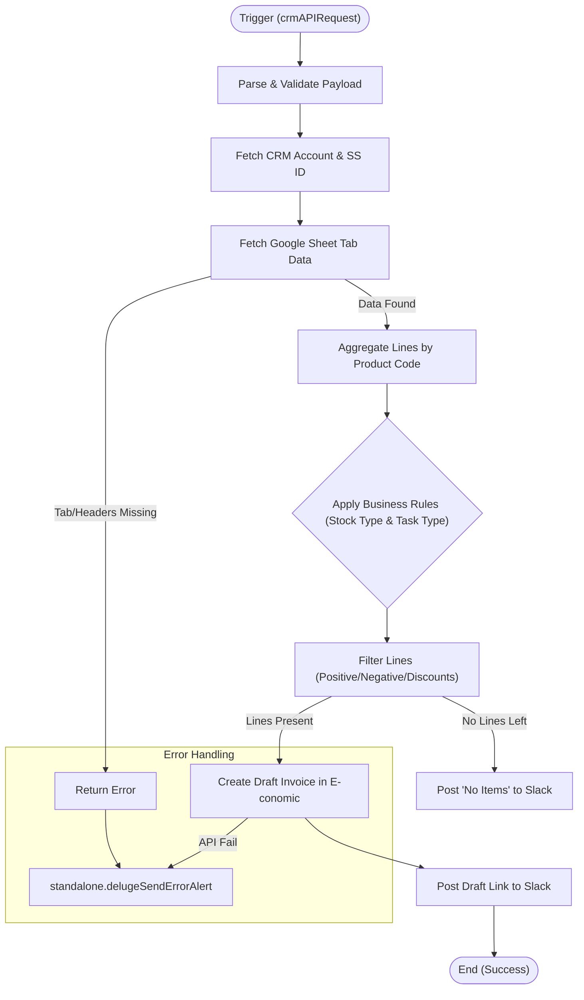

**Postman Documentation:** [Link to API Collection Placeholder]

---

## Overview
This script automates the generation of draft invoices in **E-conomic** (accounting software) based on sales and renewal data stored in **Google Sheets**. It acts as a bridge between the Cordulus CRM, Google Sheets data exports, and the accounting department's workflow. 

The script is typically triggered by an external process or button, fetches a specific tab from a distributor's spreadsheet (e.g., "January 2026 (Renewals)"), aggregates product lines, applies complex business logic regarding stock types (Sales vs. Consignment), and creates the final draft invoice.

## Technical Contract
- **Input:** `crmAPIRequest` (String/JSON) containing `distributor_id`, `task_type` (Renewals/New Sales), `month`, `year`, and `download_link`.
- **Output:** `String` (Returns "success", "success: No items to invoice", or an "error: [message]" string).
- **Primary Entities:** 
    - **Zoho CRM:** Accounts (Distributor details, E-conomic mapping).
    - **Google Sheets:** Source of line-item data.
    - **E-conomic:** Target for draft invoice creation.
    - **Slack:** Notification channel for success/failure alerts.

## Dependency Map
This script orchestrates the following internal functions and external services:

| Function / Service | Purpose | Criticality |
| --- | --- | --- |
| Google Sheets API | Fetches raw line-item data from distributor-specific spreadsheets. | High |
| E-conomic API | Retrieves customer profiles and creates draft invoices. | High |
| [[delugePostSuccessMessageToSlack]] | Posts a confirmation link to the draft invoice and source data to Slack. | Medium |
| [[delugeSendErrorAlert]] | Notifies developers/admin of script failures via Slack/Email. | High |

## Logic Flow

## Core Logic Sections

### 1. Dynamic Spreadsheet Retrieval
The script identifies the Google Sheet ID from the CRM Account's `Renewals_and_New_Sales_Data` field. It dynamically constructs the tab name using the format: `[Month] [Year] ([Task Type])`. It uses a `googlesheets` connection to fetch cell values from `A1:Z500`.

### 2. Header-Based Parsing & Aggregation
Rather than relying on fixed column indexes, the script searches for `Item Name` to find the header row. It then aggregates data into a `summaryMap`.
- Multiple rows with the same "E-conomic Product Code" are summed into a single line.
- It separately handles discount tiers (percentage-based) by checking for `E-conomic Product Code (Discount Tier)`.

### 3. Business Rule Engine
The script applies specific accounting rules to determine which lines should appear on an invoice vs. a credit note:
- **New Sales + Stock Type 'Sales':** Only credits negative items (returns).
- **New Sales + Stock Type 'Consignment':** Invoices positive items.
- **Renewals + Stock Type 'Sales':** Invoices positive items and credits discount lines.
- **Renewals + Stock Type 'Consignment':** Invoices positive items.

### 4. Accounting Integration (E-conomic)
It maps CRM Account data to E-conomic customer numbers, layouts, and VAT zones. It handles currency conversion using an `exchange_rate` passed in the payload (defaulting to 1). The final payload is POSTed to the `/invoices/drafts` endpoint.

## Developer Notes

> [!IMPORTANT]
> The script relies on a specific tab naming convention in Google Sheets: `Month Year (Task Type)`. If the spreadsheet tab is named differently (e.g., missing a space or using a short month name), the script will fail.

> [!WARNING]
> The line aggregation logic assumes that the "E-conomic Product Code" is the unique identifier. If multiple products share a code but have different unit prices, their prices will be averaged or distorted during the division calculation for `unitNetPrice`.

> [!TIP]
> This script uses a dynamic header search. If the column order in the Google Sheet changes, the script will still function as long as the header names (`Item Name`, `Quantity`, etc.) remain identical.

## Change Log
- **2025-01-24T10:45:00.000Z:** Initial creation of documentation for V2. Updated to include dynamic header parsing and discount tier aggregation.