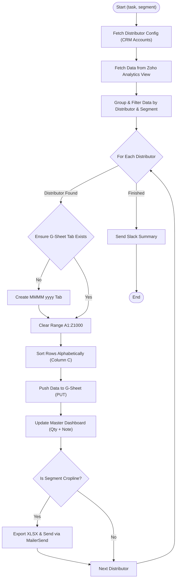

**Postman Documentation:** [Link to API Collection Placeholder]

---

## Overview
The `delugeRenewalsAndNewSalesExportHandler` is a high-level orchestration script designed to automate the export of sales and renewal data from Zoho Analytics into individual distributor Google Sheets. It serves as a bridge between the Cordulus reporting engine (Zoho Analytics) and the external-facing reporting tools provided to distributors. 

The script handles data filtering by product segment (Cordulus vs. Cropline), performs alphabetical sorting, updates a master tracking dashboard, and optionally emails the generated reports to specific stakeholders via MailerSend.

## Technical Contract
- **Input:** 
    - `task` (String): Determines the data set to fetch. Accepted values: `"Renewals"`, `"New Sales"`.
    - `segment` (String): Determines product filtering and the target dashboard. Accepted values: `"Cordulus"`, `"Cropline"`.
- **Output:** `String` (Empty string on completion).
- **Primary Entities:** 
    - **Zoho CRM**: Account (Distributor) spreadsheet configuration.
    - **Zoho Analytics**: Data source for sales/renewal records.
    - **Google Sheets API**: Target for data population and dashboard updates.
    - **MailerSend**: Email delivery service for Cropline reports.

## Dependency Map
This script orchestrates the following internal functions and external services:

| Function / Service | Purpose | Criticality |
| --- | --- | --- |
| [[delugeSendErrorAlert]] | Reports failures in sheet creation or data clearing. | High |
| [[delugePostSuccessMessageToSlack]] | (Referenced) Reports execution summary to Slack. | Medium |
| **Zoho Analytics API** | Source of truth for raw renewal and sales data. | Mission Critical |
| **Google Sheets API** | Host for distributor-facing reports and master tracking. | Mission Critical |
| **MailerSend API** | Third-party SMTP for distributing XLSX exports. | Medium |

## Logic Flow

## Core Logic Sections

### 1. CRM Configuration & Analytics Retrieval
The script identifies target spreadsheets by reading the `Renewals_and_New_Sales_Data` (or Cropline variant) URL fields from the Accounts module. It then performs a `GET` request to Zoho Analytics using hardcoded `viewId` values mapped to the `task` parameter.

### 2. Data Processing & Sorting
Data is filtered against an `allowedProducts` list based on the segment. Before pushing to Google Sheets, the script performs a manual alphabetical sort using a `Map` where the key is the Customer Name (Column C) suffixed with an index to prevent collisions.

### 3. Google Sheets Integration
- **Dynamic Tabs**: Creates tabs named after the target month (e.g., "January 2025 (Renewals)").
- **Batch Updates**: Uses `valueInputOption=USER_ENTERED` to ensure formulas (like `SUM`) and date formats are parsed correctly.
- **Master Tracking**: Maps the month name to a specific column (C-N) in the "Tracking Dashboard" spreadsheet to log the total quantity of subscriptions.

### 4. Cropline-Specific Reporting
For the "Cropline" segment, the script exports the newly updated sheet as a `.xlsx` file using the Google Sheets export endpoint. This file is Base64 encoded and dispatched via the MailerSend API to a predefined recipient.

## Developer Notes

> [!WARNING]
> This script contains hardcoded Workspace IDs, Org IDs, View IDs, and Dashboard Spreadsheet IDs. If these resources are moved or deleted in Zoho Analytics or Google Drive, the script will fail.

> [!CAUTION]
> The sort logic assumes the "Customer Name" is always at Index 2 (Column C). If the `defaultHeaderMap` is modified, the sorting index in the processing loop must be updated accordingly.

> [!IMPORTANT]
> The script uses `subList(1, size)` to separate headers from data for sorting. Ensure the `defaultHeaderMap` always contains at least one entry to avoid index out of bounds errors.

## Change Log
- **2025-01-24T12:00:00.000Z:** Initial creation of documentation via DeluluDocu. Added details on currency handling, Google Sheets sorting logic, and MailerSend integration.