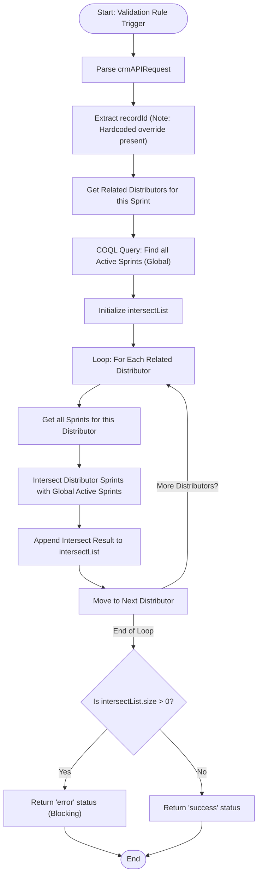

**Postman Documentation:** [Link to API Collection Placeholder]

---

## Overview
The `validation_rule.sendToActiveCampaignLimit` function is a Zoho CRM Validation Rule script. Its purpose is to prevent a Sales Sprint from being activated (or sent to Active Campaign) if any of its associated Distributors (Accounts) are already participating in another active Sales Sprint. This prevents a single distributor from receiving conflicting campaign communications.

## Technical Contract
- **Input:** `String crmAPIRequest` (JSON payload from CRM Validation Rule).
- **Output:** `Map` (Containing `status` and `message` for the CRM UI).
- **Primary Entities:** 
    - `Sales_Sprints` (Current record context)
    - `Accounts` (Related Distributors)
    - `Related_Distributor_Accounts` (Linking module/Related List)

## Dependency Map
This script orchestrates the following internal functions and external services:

| Function / Service | Purpose | Criticality |
| --- | --- | --- |
| `Zoho CRM COQL API` | Retrieves all globally active Sales Sprints for comparison. | High |

## Logic Flow

## Core Logic Sections

### 1. Distributor Identification
The script identifies all distributors linked to the current Sales Sprint record via the `Related_Distributor_Accounts` related list.

### 2. Global State Comparison (COQL)
It performs a COQL query to identify every Sales Sprint in the system that is currently marked as `Active` and enabled for `Active Campaign`. These IDs are stored in `activeSalesSprintIds` for comparison.

### 3. Validation Loop & Collection
For every distributor linked to the current record, the script:
1. Retrieves all Sales Sprints associated with that specific distributor via the `Related_Sales_Sprints_2` related list.
2. Uses the `.intersect()` method to find matching IDs between the distributor's sprints and the global active sprints.
3. **New Logic:** Appends the result of each intersection into a master `intersectList`.

## Developer Notes

> [!CAUTION]
> **Hardcoded ID Regression:** The previous fix for dynamic `recordId` retrieval has been overwritten. Line 9 now contains a hardcoded ID `520877000208751093`, which will cause the validation rule to always target a specific record regardless of where it is triggered.

> [!CAUTION]
> **Critical Logic Flaw (Collection):** The check `if(intersectList.size() > 0)` is logically flawed. The script adds the result of `.intersect()` to the list for *every* distributor checked. Even if the intersection is empty (no conflict), an empty list object is still added to `intersectList`. Consequently, if a Sales Sprint has even one related distributor, `intersectList.size()` will be greater than 0, causing the validation to trigger an error even when no actual conflict exists.

> [!TIP]
> **Scoping Improved:** The script now correctly aggregates results to be checked outside of the distributor loop, addressing the previous "Last Distributor Only" bug, though the implementation of the collection check needs refinement.

## Change Log
- **2026-03-20T12:22:15.384Z:** Initial creation of documentation. Logic identified as a validation rule for distributor-campaign constraints.
- **2026-03-20T13:48:48.743Z:** Updated script to handle multiple distributors per Sales Sprint. Switched from single-account validation to a nested loop checking all linked distributors. Refined error message to return names of conflicting sprints. Added warnings regarding hardcoded IDs and loop scoping.
- **2026-03-20T13:50:45.491Z:** Logic simplification update. The mapping of Sprint IDs to Sprint Names for the error message has been removed/commented out. The error message now returns raw IDs. The "Last Distributor Only" logic bug remains present.
- **2026-03-20T13:51:16.768Z:** Minor text update to the error message string. The prefix was changed from "Conflict with: " to "Conflict with Sales Sprint (ID): ". No functional logic or bug fixes were applied in this revision; hardcoded IDs and scoping issues persist.
- **2026-03-20T14:01:36.169Z:** **Critical Bug Fix:** Removed the hardcoded `recordId` and replaced it with dynamic retrieval from `crmAPIRequest`. Cleaned up redundant code inside the active sprint loop. The scoping bug (validating only the last distributor) remains unresolved and requires architectural correction in a future update.
- **2026-03-20T14:25:18.159Z:** **Logic and Regression Update:** Re-introduced a hardcoded `recordId`. Modified the validation logic to use a collection list (`intersectList`) to attempt to solve the loop scoping issue. Introduced a new logical bug where the validation blocks any record with a distributor because it counts iterations rather than conflict counts.