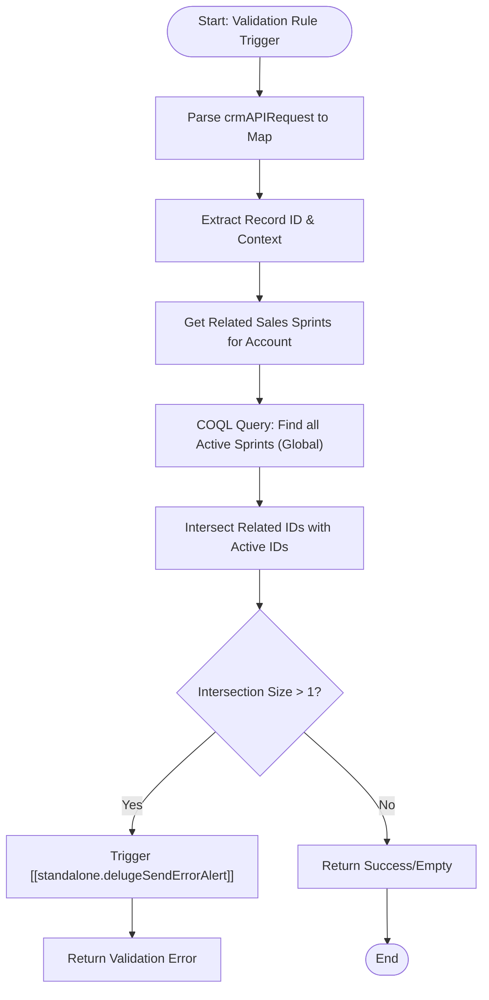

**Postman Documentation:** [Link to API Collection Placeholder]

---

## Overview
The `sendToActiveCampaignLimit` function is designed as a **CRM Validation Rule** script. Its primary purpose is to enforce a business constraint: ensuring that a Distributor (Account) is not associated with more than one active Sales Sprint that is flagged for syncing with Active Campaign. 

It prevents data duplication or conflicting campaign triggers by checking the intersection of "Sprints related to the Distributor" and "Globally Active Sprints" via a COQL query.

## Technical Contract
- **Input:** `String crmAPIRequest` (The standard JSON payload sent by Zoho CRM Validation Rules).
- **Output:** `String` (or `Map` for validation success/failure messages).
- **Primary Entities:** 
    - `Accounts` (Distributors)
    - `Sales_Sprints` (Custom Module)

## Dependency Map
This script orchestrates the following internal functions and external services:

| Function / Service | Purpose | Criticality |
| --- | --- | --- |
| [[standalone.delugeSendErrorAlert]] | Dispatches error notifications if multiple active sprints are detected. | High |
| `Zoho CRM COQL API` | Used to perform a filtered search for active sales sprints across the entire module. | High |

## Logic Flow

## Core Logic Sections

### 1. Context Extraction
The script begins by converting the `crmAPIRequest` string into a map. It identifies the current record being edited or created to establish the context for the validation.

### 2. Active Sprint Discovery (COQL)
The script utilizes a COQL (Zoho CRM Object Query Language) query to find all records in the `Sales_Sprints` module where:
- `Sales_Sprint_Active` is 'Yes'
- `Send_to_Active_Campaign` is true

This provides a global list of "Active" sprints to compare against the specific record's relationships.

### 3. Conflict Validation (Intersection)
The core validation logic uses the `.intersect()` method:
1. It collects IDs of sprints related to the Distributor.
2. It collects IDs of all active sprints in the system.
3. If the intersection of these two lists contains more than one record, it indicates a violation of the "one active sprint per distributor" rule.

## Developer Notes

> [!WARNING]
> **Code Status:** A significant portion of the logic in the provided snippet is currently commented out or structured as a template. Before deployment, ensure the COQL connection name `"zohocrmconnection"` exists in the environment.

> [!IMPORTANT]
> **COQL Limits:** The COQL API has a limit of 200 records per page. If the number of active Sales Sprints globally exceeds 200, pagination logic will need to be implemented.

> [!NOTE]
> The script uses the technical name `Sales_Campaigns_2` as the lookup field key within the related records loop; ensure this matches the actual API name of the lookup field on the Sales Sprint module.

## Change Log
- **2026-03-20T12:22:15.384Z:** Initial creation of documentation via DeluluDocu. Logic identified as a validation rule for distributor-campaign constraints.