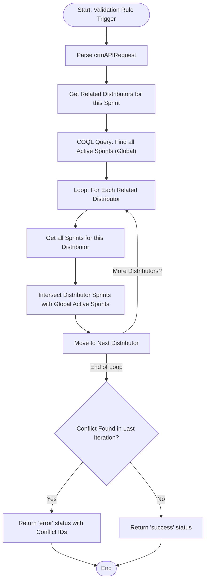

**Postman Documentation:** [Link to API Collection Placeholder]

---

## Overview
The `validation_rule.sendToActiveCampaignLimit` function is a Zoho CRM Validation Rule script. Its purpose is to prevent a Sales Sprint from being activated (or sent to Active Campaign) if any of its associated Distributors (Accounts) are already participating in another active Sales Sprint. This prevents a single distributor from receiving conflicting campaign communications.

## Technical Contract
- **Input:** `String crmAPIRequest` (JSON payload from CRM Validation Rule).
- **Output:** `Map` (Containing `status` and `message` for the CRM UI).
- **Primary Entities:** 
    - `Sales_Sprints` (Current record context)
    - `Accounts` (Related Distributors)
    - `Related_Distributor_Accounts` (Linking module/Related List)

## Dependency Map
This script orchestrates the following internal functions and external services:

| Function / Service | Purpose | Criticality |
| --- | --- | --- |
| `Zoho CRM COQL API` | Retrieves all globally active Sales Sprints for comparison. | High |

## Logic Flow

## Core Logic Sections

### 1. Distributor Identification
The script identifies all distributors linked to the current Sales Sprint record via the `Related_Distributor_Accounts` related list.

### 2. Global State Comparison (COQL)
It performs a COQL query to identify every Sales Sprint in the system that is currently marked as `Active` and enabled for `Active Campaign`. These IDs are stored in `activeSalesSprintIds` for comparison.

### 3. Validation Loop
For every distributor linked to the current record, the script:
1. Retrieves all Sales Sprints associated with that specific distributor via the `Related_Sales_Sprints_2` related list.
2. Uses the `.intersect()` method to see if any of those associated sprints match the global list of "Active" sprints.

## Developer Notes

> [!CAUTION]
> **Hardcoded ID Bug:** The script still contains a hardcoded ID `recordId = 520877000208751093;`. This bypasses the dynamic `crmAPIRequest` and will cause the validation to fail or point to the wrong record in production. This must be changed to `recordId = recordMap.get("id");`.

> [!CAUTION]
> **Logic Scope Issue:** The check `if(salesSprintIntersect.size() > 0)` is located *outside* the distributor loop. Because `salesSprintIntersect` is overwritten in every iteration of the loop, the validation rule only checks the **very last distributor** processed. Conflicts for previous distributors in the list are ignored.

> [!IMPORTANT]
> **User Experience Change:** The code that matched conflicting IDs back to Record Names (`alreadyActiveList`) has been commented out. The validation error message now displays raw Record IDs to the user (e.g., "Conflict with: [12345, 67890]"), which is significantly less user-friendly than the previous version.

> [!TIP]
> This script returns a specific Map format `{"status": "error", "message": "..."}` which is required for Zoho CRM Validation Rules to display custom error messages directly on the record UI.

## Change Log
- **2026-03-20T12:22:15.384Z:** Initial creation of documentation. Logic identified as a validation rule for distributor-campaign constraints.
- **2026-03-20T13:48:48.743Z:** Updated script to handle multiple distributors per Sales Sprint. Switched from single-account validation to a nested loop checking all linked distributors. Refined error message to return names of conflicting sprints. Added warnings regarding hardcoded IDs and loop scoping.
- **2026-03-20T13:50:45.491Z:** Logic simplification update. The mapping of Sprint IDs to Sprint Names for the error message has been removed/commented out. The error message now returns raw IDs. The "Last Distributor Only" logic bug remains present.