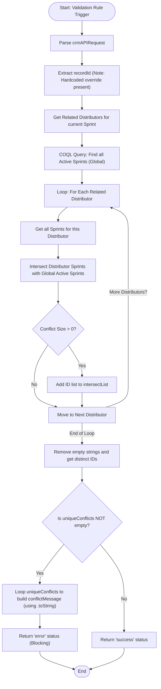

**Postman Documentation:** [Link to API Collection Placeholder]

---

## Overview
The `validation_rule.sendToActiveCampaignLimit` function is a Zoho CRM Validation Rule script designed to enforce a "One Active Campaign per Distributor" policy. It checks if any Distributors (Accounts) linked to the current Sales Sprint are already associated with other Sales Sprints currently marked as active and enabled for Active Campaign. HEY

## Technical Contract
- **Input:** `String crmAPIRequest` (JSON payload from CRM Validation Rule).
- **Output:** `Map` (Containing `status` and `message` for the CRM UI).
- **Primary Entities:** 
    - `Sales_Sprints` (Current record context)
    - `Accounts` (Related Distributors)
    - `Related_Distributor_Accounts` (Linking module/Related List)

## Dependency Map
This script orchestrates the following internal functions and external services:

| Function / Service | Purpose | Criticality |
| --- | --- | --- |
| [[Zoho CRM COQL API]] | Retrieves all globally active Sales Sprints for comparison. | High |

## Logic Flow

## Core Logic Sections

### 1. Contextual Data Retrieval
The script identifies the Sales Sprint record and fetches all distributors associated with it via the `Related_Distributor_Accounts` related list. 

### 2. Global Active State Check
It uses a COQL query to build a list of all `Sales_Sprints` IDs where `Sales_Sprint_Active` is 'Yes' and `Send_to_Active_Campaign` is true.

### 3. Conflict Detection Loop
For every distributor linked to the current sprint, the script:
1. Retrieves all sprints linked to that specific distributor.
2. Intersects that distributor's sprints with the global list of active sprints.
3. If the intersection size is greater than 0, the conflicting IDs are added to the `intersectList`.

### 4. Conflict Reporting
If `uniqueConflicts` is not empty, the script builds a human-readable string (`conflictMessage`). It uses `.toString()` on IDs to ensure matching types during comparison between the conflict list and the source records.

## Developer Notes

> [!CAUTION]
> **Hardcoded ID Regression:** The dynamic `recordId` retrieval is still being overwritten by a hardcoded ID `520877000208751093` on line 9. This renders the validation rule non-functional for any record other than the specific test record.

> [!TIP]
> **Logic Bug Resolved:** The "False-Positive" bug has been resolved. By wrapping the `intersectList.addAll()` in a size check (`if(salesSprintIntersect.size() > 0)`), the script no longer adds empty list strings (`"[]"`) to the results, ensuring the validation only triggers on real conflicts.

> [!TIP]
> **Type Mismatch Resolved:** The script now uses `.toString()` when comparing record IDs in the conflict message builder: `if(rec.get("Sales_Campaigns_2").get("id").toString() == id.toString())`. This ensures that BigInt/Long types correctly match String types in the loop.

## Change Log
- **2026-03-20T12:22:15.384Z:** Initial creation of documentation. Logic identified as a validation rule for distributor-campaign constraints.
- **2026-03-20T13:48:48.743Z:** Updated script to handle multiple distributors per Sales Sprint. Switched from single-account validation to a nested loop checking all linked distributors. Refined error message to return names of conflicting sprints. Added warnings regarding hardcoded IDs and loop scoping.
- **2026-03-20T13:50:45.491Z:** Logic simplification update. The mapping of Sprint IDs to Sprint Names for the error message has been removed/commented out. The error message now returns raw IDs. The "Last Distributor Only" logic bug remains present.
- **2026-03-20T13:51:16.768Z:** Minor text update to the error message string. The prefix was changed from "Conflict with: " to "Conflict with Sales Sprint (ID): ". No functional logic or bug fixes were applied in this revision; hardcoded IDs and scoping issues persist.
- **2026-03-20T14:01:36.169Z:** **Critical Bug Fix:** Removed the hardcoded `recordId` and replaced it with dynamic retrieval from `crmAPIRequest`. Cleaned up redundant code inside the active sprint loop. The scoping bug (validating only the last distributor) remains unresolved and requires architectural correction in a future update.
- **2026-03-20T14:25:18.159Z:** **Logic and Regression Update:** Re-introduced a hardcoded `recordId`. Modified the validation logic to use a collection list (`intersectList`) to attempt to solve the loop scoping issue. Introduced a new logical bug where the validation blocks any record with a distributor because it counts iterations rather than conflict counts.
- **2026-03-20T14:47:13.537Z:** **Reporting Logic Update:** Modified the loop to use `.toText()` when adding to the intersect list. Added a new nested loop intended to resolve Distributor names for the conflict message. Introduced several critical syntax and logic errors, including an invalid equality operator (`=`) and a type mismatch between stringified lists and IDs that prevents the conflict message from populating correctly while still triggering a false-positive validation error.
- **2026-03-20T14:52:01.437Z:** **Code Cleanup:** Removed several `info` debugging statements that were outputting `intersectList` and its size. The core functional logic, including the hardcoded ID regression and the false-positive validation error caused by stringified empty lists, remains unchanged.
- **2026-03-20T14:53:54.840Z:** **Syntax Fix and Debugging:** Corrected the assignment operator (`=`) to an equality operator (`==`) in the conflict message builder loop. Re-added `info` statements for `intersectList` and its distinct size to facilitate debugging of the false-positive validation issue. The hardcoded ID and type mismatch logic bugs persist.
- **2026-03-20T14:57:32.725Z:** **Commentary Update:** Added a code comment claiming the type mismatch between stringified lists and record IDs is resolved. However, no functional code changes were implemented to parse the stringified IDs or handle the empty list string ("[]"), so the false-positive validation error and message population failure persist.
- **2026-03-20T15:02:00.088Z:** **Structural Refactoring:** Updated the conflict check condition from `.size() > 0` to `!isEmpty()`. Moved the conflict message construction logic inside the conditional block. These changes do not resolve the underlying logical issues regarding hardcoded IDs, stringified list comparisons, or false-positive triggers caused by empty intersection strings ("[]").
- **2026-03-20T15:10:15.209Z:** **Logic and Type Fix:** Refined the collection logic to only add to `intersectList` if `size() > 0`, resolving the false-positive trigger caused by empty list strings. Implemented `.toString()` comparisons in the conflict builder loop to resolve type mismatch issues between IDs. The hardcoded `recordId` regression remains.