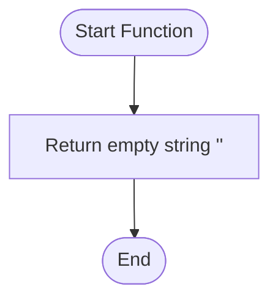

**Postman Documentation:** [Link to API Collection Placeholder]

---

## Overview
The `testdeletapikey` function appears to be a placeholder or a stub script within the `standalone` namespace. Based on its nomenclature, it is intended to handle the deletion or testing of API key removal logic; however, in its current state, it performs no operations and simply returns an empty string.

## Technical Contract
- **Input:** None
- **Output:** `string` (Empty string `""`)
- **Primary Entities:** None

## Dependency Map
This script orchestrates the following internal functions and external services:

| Function / Service | Purpose | Criticality |
| --- | --- | --- |
| N/A | No external dependencies or internal functions are called. | Low |

## Logic Flow

## Core Logic Sections

### 1. Initialization and Return
The script contains no complex logic. It immediately executes a return statement, providing an empty string to the caller.

## Developer Notes

> [!WARNING]
> This script is currently a **stub**. It does not contain any logic to validate, identify, or delete API keys. It should not be used in production workflows expecting actual key management functionality.

> [!NOTE]
> As a standalone function, this can be invoked directly. If this is meant to be a security-related function (deleting keys), ensure that future implementations include robust permission checks and logging.

## Change Log
- **2026-04-01T06:35:42.394Z:** Initial creation of documentation via DeluluDocu.